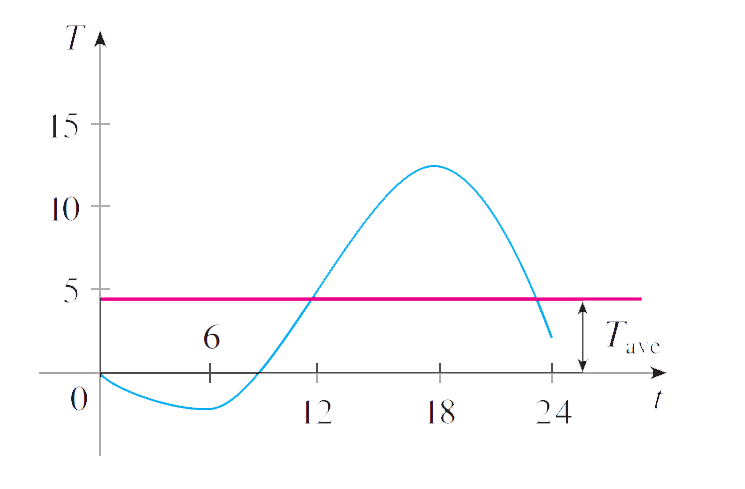
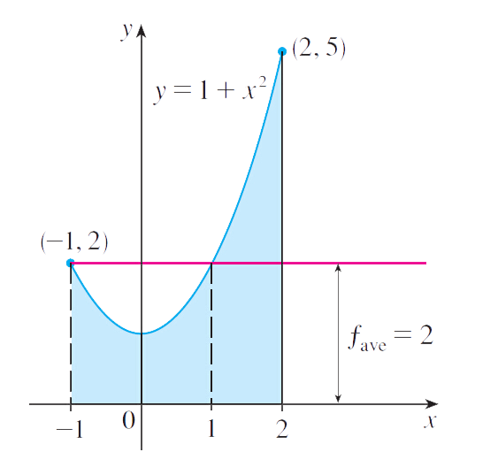
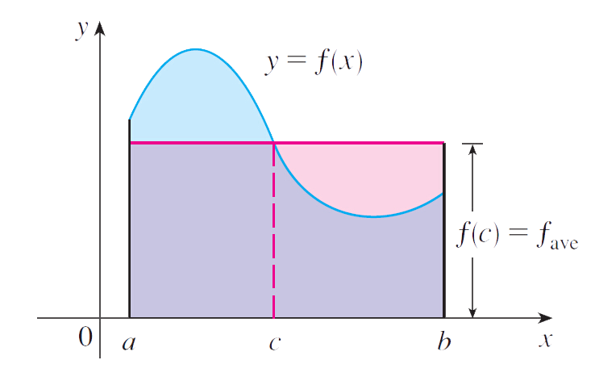

## AVERAGE VALUE OF A FUNCTION
<small> Created by Pengxiang Li   2015.9.30 </small>

--- ds:soothe

## OUTLINES

- Introduction
- Problem Analysis
- Theorem
- Example

--- &vertical ds:blackout
## Introduction

***
>- It is easy to calculate the average value of finitely many numbers $y_{1}$,$y_{2}$,...,$y_{n}$:
$$ y_{ave}=\frac{y_{1} + y_{2} + \cdots+y_{n}}{n} $$

>- But how do we compute the average temperature during a day if infinitely many temperature readings are possible?

>- Figure1 shows the graph of a temperature function T(t).

***

--- &vertical 

## Problem Analysis

***
* IN general,let’s try to compute the average of a function $y=f(x),a \leq x \leq b$ .We start by dividing the interval [a,b] into n equal subintervals,each with length $\Delta x = \frac{b-a}{n}$.
- We choose points $x_{1}^{*},...,x_{n}^{*}$ in successive subintervals and calculate the average of the numbers $f(x_{1}^{*}),...,f(x_{n}^{*})$ :

$$ \frac{f(x_{1}^{*}) + \cdots + f(x_{n}^{*})}{n} $$
- Since $\Delta x = \frac{b-a}{n}$,we can get the average value becomes

$$ \frac{f(x_{1}^{*}) + \cdots + f(x_{n}^{*})}{\frac{b-a}{\Delta x}} = \frac{1}{b-a}[f(x_{1}^{*}\Delta x) + \cdots + f(x_{n}^{*}\Delta x)] $$
$$= \frac{1}{b-a}\sum_{i=1}^{n}f(x_{i}^{*})\Delta x $$

***
- If we let n increase,by the definition of a definite integral,the limiting value is:

$$ \lim_{n \to \infty}\frac{1}{b-a}\sum_{i=1}^{n}f(x_{i}^{*})\Delta x = \frac{1}{b-a}\int_{a}^{b}f(x)dx $$
- In general,we define the **average value of f** on the interval [a,b] as:

$$ f_{ave} = \frac{1}{b-a}\int_{a}^{b}f(x)dx $$

--- &vertical ds:soothe

## Example 1

***
- Find the average value of the function $f(x) = 1 + x^{2}$ on the interval[1,2].

***
- With a=-1 and b=2 we have 
$$ f_{ave} = \frac{1}{b-a}\int_{a}^{b}f(x)dx = \frac{1}{2-(-1)}\int_{-1}^{2}(1 + x^{2})dx = \frac{1}{3}[x + \frac{x^{3}}{3}]_{-1}^{2} = 2 $$

---

--- &vertical ds:alert
## THEOREM

***
- If T(t) is the temperature at time t,we might wonder if there is a specific time when the tempure is the same as the average tempure.
- In other words,is there a number c at which the value of a function f is exactly equal to the average value of the function,that is,$f(c) = f_{ave}$?

***
- *THE MEAN VALUE THEOREM FOR INTERALS*
  - If f is continuous on [a,b],then there exists a number c in [a,b] such that
 $$ f(c) = f_{ave} = \frac{1}{b-a}\int_{a}^{b}f(x)dx $$
$$ \int_{a}^{b}f(x)dx = f(c)(b-a) $$

***
- The Mean Value Theorem for Integrals is a consequence of the Mean Value Theorem for derivatives and Fundamental Theorem of Calculas
- And how to explain the theorem with images?

---

--- &vertical ds:soothe
## Example 2

***
- Since $f(x) = 1 + x^{2}$ is continuous on the interval [-1,2],the Mean Value Theorem for Integrals says there is a number c in [-1,2]such that

$$ \int_{-1}^{2}(1 + x^{2})dx = f(c)[2-(-1)] $$
$$1 + c^{2} = 2$$
$$c^{2} = 1 $$

- So in this case there happen to be two numbers $c = \pm 1$ in the interval[-1,2] that work in the Mean Value Theorem for Integral.

***
## Example 3

***
- Show that the average velocity of a car over a time interval
$[t_{1},t_{2}]$ is the same as the average of its velocities during the trip.

***
- If s(t) is the distance of the car at time t,then,by definition,the average velocity of the car over the interval is

$$ \frac{\Delta s}{\Delta t} = \frac{s(t_{2})-s(t_{1})}{t_{2}-t_{1}} $$
- on the other hand,the average value of the velocity function on the interval is:
$$ v_{ave} = \frac{1}{t_{2}-t_{1}}\int_{t_{1}}^{t_{2}}v(t)dt = \frac{1}{t_{2}-t_{1}}\int_{t_{1}}^{t_{2}}s'(t)dt$$
$$= \frac{1}{t_{2}-t_{1}}[s(t_{2})-s(t_{1})] = \frac{s(t_{2})-s(t_{1})}{t_{2}-t_{1}} = average \ velocity $$

---

---
## Thank you!
    
    

